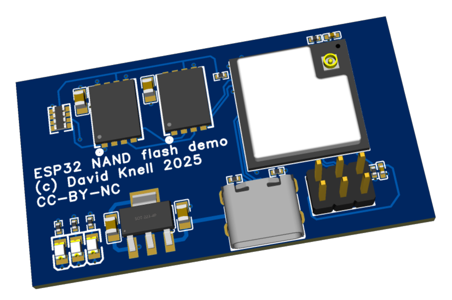

# YAFFS ESP32 Demo Board

This folder contains the reference hardware design for the YAFFS-on-ESP32 demo platform used by the accompanying sample project.

The design is centered on an `ESP32-S3-MINI-1U-N4R2` module and two `W25N04KVZEIR` SPI NAND devices so the software example can mount YAFFS on external flash.

## Folder Contents

- `ESP32 - flash.epro` - EasyEDA project archive for the schematic and PCB
- `schematic.pdf` - exported schematic
- `PCB.png` - PCB preview image

## Hardware Summary

The current board design includes:

- `ESP32-S3-MINI-1U-N4R2` module (`ESP1`)
- two `W25N04KVZEIR` 4 Gbit SPI NAND devices (`U1`, `U2`)
- USB Type-C connector (`USB1`)
- `AMS1117-3.3` regulator (`U11`) generating the `+3.3V` rail from `VBUS`
- UART / bring-up header exposing `U0RXD`, `U0TXD`, and `GPIO0`
- `ESP32_EN` reset network
- indicator LEDs and standard decoupling / pull resistor support

The NAND devices share the SPI data and clock lines:

- `SPI_D0`
- `SPI_D1`
- `SPI_D2`
- `SPI_D3`
- `SPI_CLK`

Each flash has its own chip select:

- `SPI_CS0`
- `SPI_CS1`

